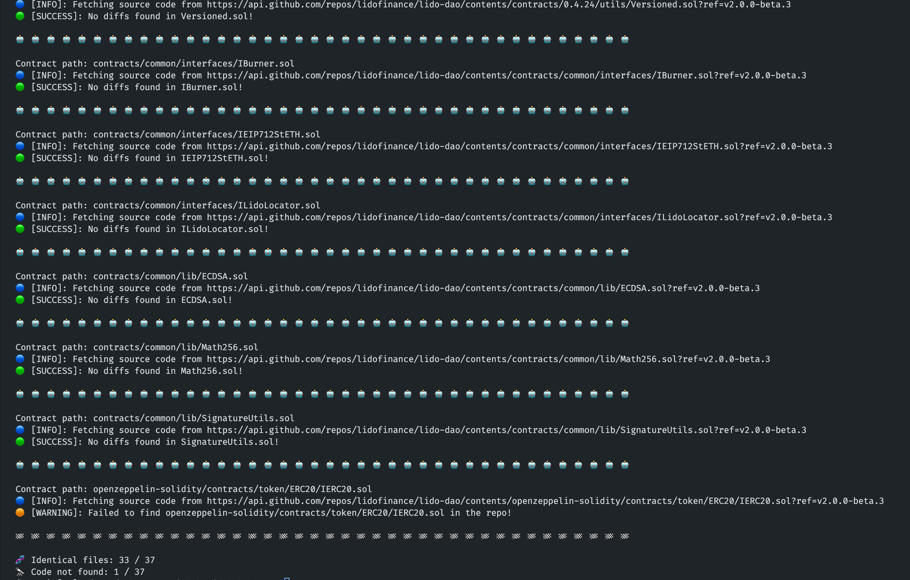

# Diffyscan

Diff your Github code against Etherscan verified source code.

## Usage

Set your Github token to query API without strict rate limiting,
```bash
export GITHUB_TOKEN=<your-github-token>
```

Set your Etherscan token to fetch verified source code,
```bash
export ETHERSCAN_TOKEN=<your-etherscan-token>
```

Specify a contract address to diff the source code,
```bash
export CONTRACT_ADDRESS=<contract-address>
```

Specify the Github repo to diff the contract code,
```bash
export REPO_LINK=<github-repo-link>
```

Start the script
```bash
python3 main.py
```


## Screenshots



## Todos
- add support for vyper
- automatic dependency diffing