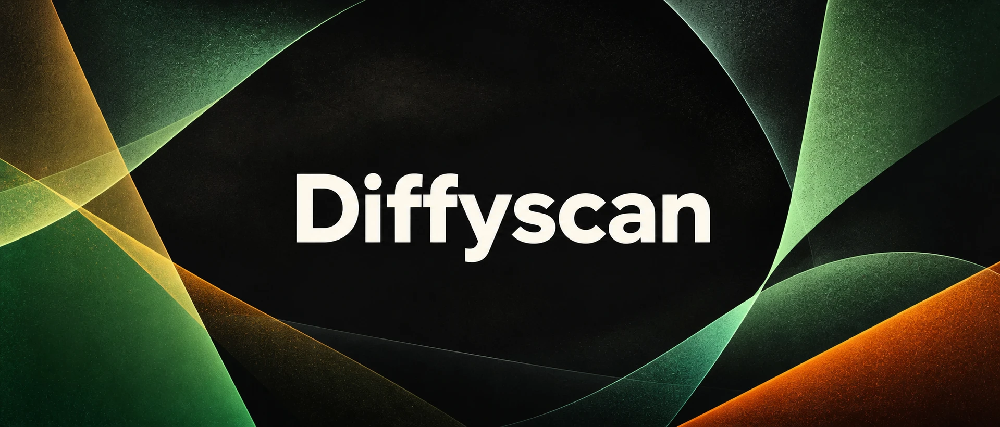

<h1 align="center">
  
</h1>

<p align="center">
  Source and bytecode verification for deployed EVM smart contracts.
</p>

<p align="center">
  <a href="https://github.com/lidofinance/diffyscan/actions/workflows/regression.yml"></a>
  <a href="pyproject.toml"></a>
  <a href="pyproject.toml"></a>
  <a href="LICENSE"></a>
</p>

<p align="center">
  <a href="#quick-start">Quick Start</a> ·
  <a href="config_samples/">Config Samples</a> ·
  <a href="#what-it-checks">What It Checks</a> ·
  <a href="#development">Development</a> ·
  <a href="SECURITY.md">Security</a>
</p>

Diffyscan compares deployed EVM contracts with source code pinned to a GitHub commit. It retrieves explorer-verified sources, generates source diffs, recompiles the pinned revision, and compares the resulting runtime bytecode with live chain state. Unapproved differences produce a non-zero exit code for local and CI use.

## Quick start

Requirements: Python >=3.11,<4, [uv](https://docs.astral.sh/uv/), a GitHub API token, a block explorer API token, and an RPC endpoint for the target network.

```sh
git clone https://github.com/lidofinance/diffyscan.git
cd diffyscan
uv sync --locked
cp .env.example .env
```

Set the API tokens and RPC URLs required by your config, then run it:

```sh
uv run diffyscan config_samples/ethereum/mainnet/circuit-breaker/circuit_breaker_config.yaml
```

## What it checks

- explorer-verified sources against files at the pinned GitHub commit
- compiled runtime bytecode against code deployed on-chain
- constructor-set immutable values through remote `eth_call` simulation
- linked libraries, constructor calldata, compiler settings, and EVM version
- expected differences declared with granular `allowed_diffs` rules

## Development

```sh
uv run pytest -q
uv run mypy
uv run black --check diffyscan tests
uv run pre-commit run --all-files
```

Pull requests, bug reports, and feature requests are welcome. Report security issues through [private vulnerability reporting](SECURITY.md).

## License

[MIT](LICENSE)
